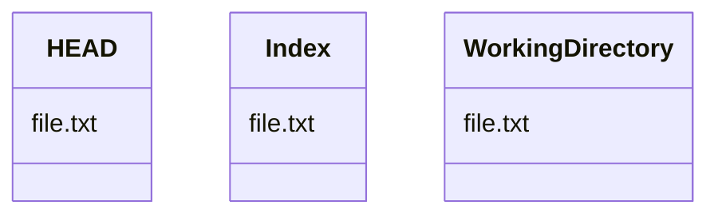

## Installing Git

### Install Git on macOS

Install Git using Homebrew:

```bash 
brew install git
```

Verify the installation was successful:

```bash
git --version
```

## Git Configuration

### Configure your Git username and email 

```bash

```

```bash 
    git config --global user.email "git@yourmail"
    git config --global user.name "Alican Toprak
```


### Set your default text editor for editing your commit messages

```bash
git config --global core.editor neovim
```

## Git Credentials

More Information about the [Credential Storage](https://git-scm.com/book/sv/v2/Git-Tools-Credential-Storage).


### How to use KeyChain on macOS to store git credentials

On macOS you can use the KeyChain with `git-credential-osxkeychain`. It's automatic installed if you [install git with homebrew](obsidian://open?vault=docs&file=page%2Fdev%2Fhomebrew%2Findex). The osxkeychain mode caches credentials in the secure keychain that’s attached to your system account. This method stores the credentials on disk, and they never expire, but they’re encrypted with the same system that stores HTTPS certificates and Safari auto-fills.

Set osxkeychain as default Credential Storage for your credentials:
```
git config --global credential.helper osxkeychain
```

 
```bash 
git credential-osxkeychain 
```


### How to use the Git Credential Manager for Windows

If you’re using Windows, you can install a helper called “Git Credential Manager for Windows.” This is similar to the “osxkeychain” helper described above, but uses the Windows Credential Store to control sensitive information. 

#### Installation

It can be found at [https://github.com/Microsoft/Git-Credential-Manager-for-Windows](https://github.com/Microsoft/Git-Credential-Manager-for-Windows).

Set the Git-Credential-Manager as default Credential Storage for your credentials:
```bash
git config --global credential.helper manager
```


### Representation

Draw a text-based graphical representation of the commit history on the left hand side of the output.

```bash
git log --all --decorate --oneline --graph
```


## Git Head vs Index vs Working Directory

Git has 

## Git reset vs checkout

`Git reset `and `checkout` both updates the HEAD, Index and Working Directory branches.


Running `git checkout [branch]` is pretty similar to running `git reset --hard [branch]` in that it updates all three trees for you to look like `[branch]`, but there are two important differences:

* unlike `reset --hard`, `checkout` is working-directory safe; it will check to make sure it’s not blowing away files that have changes to them. Actually, it’s a bit smarter than that — it tries to do a trivial merge in the working directory, so all of the files you _haven’t_ changed will be updated. `reset --hard`, on the other hand, will simply replace everything across the board without checking.
* The second important difference is how `checkout` updates HEAD. Whereas `reset` will move the branch that HEAD points to, `checkout` will move HEAD itself to point to another branch.


- Git reset

	--soft 
	--mixed
	--hard 
	


